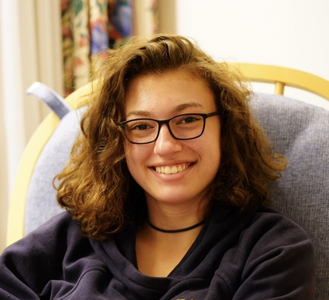

<link rel="stylesheet" href="/assets/css/main.css">

<em class='author-highlight'>I am on the job market for tenure-track faculty positions beginning in 2027.</em>  
I am a fifth-year Ph.D. candidate in Computer Science at Cornell University, where I am advised by <a class="page-link" href="https://mimno.infosci.cornell.edu">David Mimno</a> as part of the <a href="https://c2l.infosci.cornell.edu">C2L Lab</a>. My research interests lie in computational humanities, natural language processing, and cultural analytics. Specifically, I explore how large language models (LLMs) can be used for complex literary analysis tasks. My interest is both in developing and evaluated methods for humanities research and using literary texts as challenging test cases with which to explore the real-world capabilities of LLMs. I am also committed to teaching students in CS and data science, with a particular interest in introductory classes.  
In the summer of 2024 I worked as a research assistant for <a href="https://www.au.dk/en/rdkm@cc.au.dk">Ross Deans Kristensen-McLachlan</a> at the <a href="https://chc.au.dk">Center for Humanities Computing</a> at Aarhus University. During the summer of 2025, I was a research intern in the <a href="https://www.microsoft.com/en-us/research/group/ai-interaction-and-learning/">AIIL Group</a> at Microsoft, supervised by <a href="https://www.kirantomlinson.com">Kiran Tomlinson.</a> Finally, in the summer of 2026 I was the instructor of record for INFO 1100: Introduction to Programming, which I re-designed and wrote the materials for from scratch.  
In 2022, I graduated from Carleton College with a Bachelors of Arts in Computer Science and English and a minor in Digital Arts and Humanities. During this time I was advised by <a class="page-link" href="https://cs.carleton.edu/faculty/ealexander/">Eric Alexander</a> and <a class="page-link" href="https://www.carleton.edu/directory/gshuffel/">George Shuffelton</a>. I also participated in the <a class="page-link" href="https://eecs.berkeley.edu/resources/undergrads/research/superb">SUPERB REU</a> at UC Berkeley in the summer of 2021, where I was advised by <a class="page-link" href="https://schasins.com">Sarah Chasins</a> and <a class="page-link" href="https://people.eecs.berkeley.edu/~adityagp/">Aditya Parameswaran</a>.  
Please feel free to reach out to me <a href="mailto:rmh327@cornell.edu">by email</a> if you have any questions!
 

News

📝&nbsp;&nbsp;&nbsp;The work I did at Microsoft Research <a href="https://arxiv.org/pdf/2605.29018">on the trajectories of LLM users</a> was accepted at the main EMNLP conference.

📝&nbsp;&nbsp;&nbsp;Our work on the uniformity and linearity of novel summaries is <a href="https://arxiv.org/pdf/2608.17218">available as a pre-print</a>.

🍎&nbsp;&nbsp;&nbsp;I spent the summer of 2026 as lead instructor for INFO 1100: Introduction to Programming at Cornell.

📝&nbsp;&nbsp;&nbsp;Our paper on <a href="https://arxiv.org/pdf/2505.14925">benchmarks for long-context understanding</a> was accepted at <a href="https://sighum.wordpress.com/events/sighum-latech-clfl-2026/">LaTeCH-CLfL 2026</a>.

📝&nbsp;&nbsp;&nbsp;Two papers on <a href="https://arxiv.org/pdf/2409.11390">focalization analysis at scale</a> and <a href="https://arxiv.org/pdf/2507.19756">automated narrative analysis of Christian Fiction</a> were accepted at <a href="https://2025.computational-humanities-research.org">CHR 2025</a>.

📝&nbsp;&nbsp;&nbsp;Our <a href="https://arxiv.org/pdf/2504.06393">paper</a> on sensory language usage in LLMs was accepted at <a href="https://colmweb.org">COLM 2025</a>.

🌎&nbsp;&nbsp;&nbsp;I spent the summer of 2025 as a Research Intern for the <a href="https://www.microsoft.com/en-us/research/group/ai-interaction-and-learning/">AIIL group</a> at Microsoft Research!

